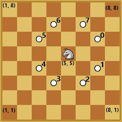

## Homework Assignment 02

This assignment is primarily focused on control statements and functions.  You will complete the assignment individually. You are not allowed to share your code with other students. The assignment is worth a total of 100 points. If you have any questions or need any help, please visit us during office hours and/or post questions on Piazza.

> If you need to post any of your actual source code on Piazza for any reason, **please** be sure to tag the post as being *visible to instructors only*, so that you don't inadvertently share code with others and violate class rules.

### Format details
Your submission will be tested and graded by an autograder, for this reason it cannot be stressed enough that your program must *exactly* follow the specifications for input and output upon submission.

For each problem you will create a program, however, this time you are free to design and write your own functions in order to implement your solution.

> As in the last assignment, you will read input from `std::cin` and print output to `std::cout`. Any print (`cout`) statements other than the expected output **must** be removed prior to submission. Pay special attention to the exact number of whitespaces when printing more complex shapes and patterns.

For additional details on expected submission instructions, please refer to the **Submission and Grading** section at the bottom of the document.

### Questions

#### 1. `draw_triangle_1`
Write a program which reads a single integer `0 < n < 20` as input and prints out a left-justified triangle. For example, if `n = 4`, output would be:
``` text
*
**
***
****
```

#### 2. `draw_triangle_2`
Write a program which reads a single integer `0 < n < 20` as input and prints out a right-justified triangle. For example, if `n = 4`, output would be:
``` text
   *
  **
 ***
****
```

#### 3. `factorial`
Write a program which reads in a single integer `0 <= n < 30` and prints out the factorial of `n`. Factorials get very big very quickly and can easily exceed the limits of a signed `int` that uses 4 bytes. If the value of factorial of `n` is too large to be stored in an `int` (>`2,147,483,647`), your program should print `Can't handle this`.

#### 4. `pow`
Write a program which reads in an integer `-15 < n < 15` and an integer `0 < k < 10` and prints the value of `n` to the power of `k`. **Cannot use the built-in function pow**.

#### 5. `prime`
Write a program which reads in an integer `0 < n <= 1,000,000,000` and prints `True` if the value is a prime number and `False` if it is not.

#### 6. `suffix_sum`
Write a program which reads in two integers `1 <= n <= 10,000` and `1 <= s <= n` and returns the sum of the last `s` elements in the sequence from `1` to `n` (inclusive). For example, if the input is `20 4` the output would be `74`.

#### 7. `sum_even`
Write a program that reads an integer `0 < n < 2^32`, returns the sum of all **digits** in `n` that are divisible by `2`. For example, if `n = 341238` the output would be `14`, because it is the sum of `4 + 2 + 8`. Hint: a signed `int` may not be enough.

#### 8. `x_of_stars`
Write a program that reads in an integer `0 < n < 10` as input and prints out an X of that height made of `*` characters. If the input is not an odd number, it should print `Sorry, not odd`. See examples below for input values of `n = 3` and `n = 5` respectively.
``` text
* *
 *
* *
```
``` text
*   *
 * *
  *
 * *
*   *
```

#### 9. `draw_triangle_3`
Write a program which reads in three integers `a, b, c`, such that `0 < {a, b, c} <= 20` and `a <= b`. The program should print the `+` character `a` times, then `a + c` times, then `a + c + c` times, and so on. This pattern should repeat while the line is at most `b` characters long. At that point, the pattern is repeated backwards. For example input `4 7 1` will output:
```
++++
+++++
++++++
+++++++
+++++++
++++++
+++++
++++
```

#### 10. `loan_payment`
 Write a program which will read three `double` values: `0 < loan <= 10^10` (the initial loan), `0 <= interest <= .5` (the monthly interest), and `0 < payment <= loan` (the monthly payment) respectively. We will assume that your monthly payment always takes place *after* the loan accrues any interest for that month. We will also assume that there will be a minimum of one month required to pay off any loan. Your program should print out the number of months required to pay off the loan. For example, input `500.0` `0.05` `499.0` will output `2`.

> It is worth noting that a 50% interest rate is just an upper bound, you should be aware of this during your local testing as you could easily encounter an infinite loop (scenarios in which the loan will never be paid off). However, you can assume that no such test cases will appear on Gradescope.

#### 11. `char_pyramid`
Write a program that reads a single character `'A' <= ch <= 'Z'` as input and prints out a pyramid of characters starting at `A` until it reaches the pyramid's base and stops. See examples below for input values of `ch = 'A'` and `ch = 'C'` respectively.
```text
A
```
```text
    A
  A B A
A B C B A
```

#### 12. `rgb_to_hex`
Write a program which reads in three integers `r, g, b` representing RGB values ranging from `0` to `255` (inclusive) and prints out their hexadecimal representation. For example, if the input is `245 13 0` the output would be `#F50D00`.

#### 13. `armstrong`
Write a program that reads in an integer `0 < n <= 10^9` as input and checks whether `n` is an *armstrong number* or not. An armstrong number is a number that is equal to the sum of its own digits raised to the power of the number of digits. For example `1634` is an armstrong number, since `1^4 + 6^4 + 3^4 + 4^4 = 1634`. Your program will print `True` if `n` is an armstrong number, and `False` otherwise.

#### 14. `perfect`
A *perfect number* is a number for which the sum of its *proper divisors* is exactly equal to the number. For example, the sum of the proper divisors of `28` would be `1 + 2 + 4 + 7 + 14 = 28`, which means that `28` is a perfect number. Write a program that reads in an integer `0 < x <= 10^4` and prints `True` if `x` is a perfect number and `False` otherwise.

#### 15. `a_lovely_rug`
Write a program which reads in an integer `0 < n <= 10` prints out this nice rug pattern. See examples below for input values of `n = 2`, `n = 3`, and `n = 4` respectively.
```text
#========#
|  <><>  |
|<>....<>|
|<>....<>|
|  <><>  |
#========#
```
```text
#============#
|    <><>    |
|  <>....<>  |
|<>........<>|
|<>........<>|
|  <>....<>  |
|    <><>    |
#============#
```
```text
#================#
|      <><>      |
|    <>....<>    |
|  <>........<>  |
|<>............<>|
|<>............<>|
|  <>........<>  |
|    <>....<>    |
|      <><>      |
#================#
```

#### 16. `circular_prime`
A number is called a *circular prime* if all rotations of its digits form a prime. For example, the number `197` is a circular prime because all possible rotations of its digits: `[197, 971, 719]` are prime numbers. Write a program that reads in an integer `1 <= n <= 10^6` as input and prints `True` if `n` is a circular prime and `False` otherwise.

#### 17. `knight_moves`
Write a program which will read in a sequence of integers.  The first two values (`x y`) represent the starting location of a knight piece on a chess board, considering the coordinate system displayed in the figure below. The succeeding numbers represent consecutive moves for the knight. Knight moves are encoded as numbers between `0` and `7` inclusive, as shown in the figure.



Your program should continuously track the location of the knight after each move until there are no more moves to read. Your program should then print out the final location of the knight in the format `<x> <y>`. If at any point during runtime, the knight is told to move off of the board, your program should print `Invalid sequence` and terminate.

For example, if the input is `5 5 0 3 5 6`, your program would output `3 7`.  If the input is `5 5 1 2 0 5 4` it would output `Invalid sequence`, because move `0` would not be possible.

> It might be useful to use standard input redirection from files for dealing with this problem (contact your TAs)

### Submission and Grading
You will submit a single zip file named `pa2.zip` through Gradescope. Your zip archive must contain your source files only. For each of the problems, create a file called `main_<num>.cpp` where `<num>` is the question number itself with no leading zeros. Your programs will be automatically graded. For each of the questions you either pass the test cases (full points) or not (zero points).

> You must be reminded that students caught cheating or plagiarizing will receive `no credit`. Additional actions, including a failing grade in the class or referring the case for disciplinary action, may also be taken.
