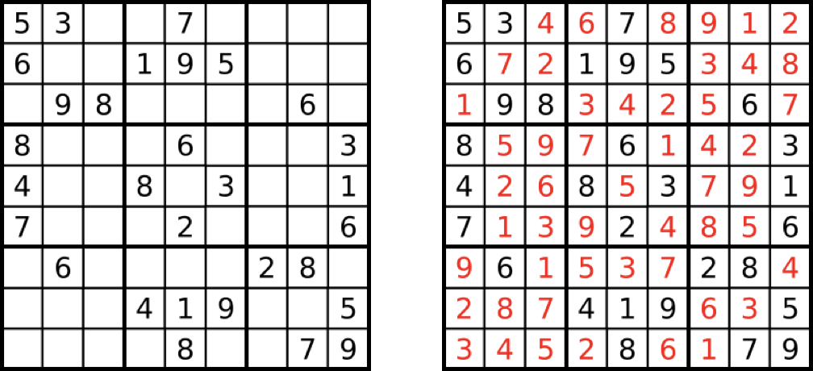

## Homework Assignment 05

This assignment is primarily focused on classes, backtracking, and reading documentation. The assignment is worth a total of 120 points. If you have any questions or need any help, please visit us during office hours and/or post questions on Piazza.

> If you need to post any of your actual source code on Piazza for any reason, **please** be sure to tag the post as being *visible to instructors only*, so that you don't inadvertently share code with others and violate class rules.

### Format details
---
Your submission will be tested and graded by an autograder, for this reason it cannot be stressed enough that your program must *exactly* follow the specifications for input and output upon submission.

For each problem you will implement a solution which follows the specifications given in the problem description.

> Unlike in previous assignments, input for these problems will come from external files and command line arguments. We haven't talked about these in class yet, but that isn't a problem as they are already implemented for you. Any print (`cout`) statements other than the expected output **must** be removed prior to submission. Pay special attention to formatting, such as number of whitespaces when printing more complex entities.

For additional details on expected submission instructions, please refer to the **Submission and Grading** section at the bottom of the document.

### Code Handouts
---
In computer science, you are not always going to be asked to write a completely new program from scratch, sometimes you will be given a preexisting piece of code and asked to make changes to it in order to satisfy the given constraints.

For this programming assignment, you are going to be given a couple source code handouts. For problems 1, 2, and 3 you will be given simple class implementations as well as main files to handle your input. For problem 4 you will be given a main which takes in the .bmp filename from the command line.

You have also been given a couple of files to help with testing each program. These are inside of the boards, puzzles, and images directories.

To test:

```

Cellgrid myGrid(fname, M, N);
cout << myGrid.countCells(row, col, conn) << endl; 
```

These two statements are commented out in cellsTest.cpp. You need to uncomment them.

And then you compile both files with

```

g++ cellgrid.cpp cellsTest.cpp -o cellgrid
```

And run the executable, passing the arguments alongside

```

./cellgrid grid.txt 8 8 3 4 4
```

grid.txt must be in the same directory with the other files you're working with

### Methodology
---
For each problems 1-3 you will implement a member function using the provided headers. You may add any number of helper methods but do *not* change the headers of the functions as these are what will be called by the autograder in order to test your solution.

Additionally, for problems 1-3 your solution *must* implement recursive backtracking. To implement recursive backtracking, you should create private recursive helper functions inside of the class which do the actual solving. Then simply call these functions from the public function called by the autograder.

Problem 4 will utilize the `bitmap_image` library which was shown in class, for this question you do *not* need to create your own class, the objective for these questions is that you learn to utilize classes in a pre-built library. This in particular means reading the official documentation and examples in order to learn how the library works.

### Problems
---

#### 1. `Counting Cells`
Consider a grid of cells in two dimensions, where each cell is considered `empty` or `filled`.  Any number of cells that are *connected* constitutes a `blob`.  Every cell can either be connected to 4 adjacent cells (vertically, horizontally) or to 8 adjacent cells (vertically, horizontally, diagonally).


#### Input

The input for this program is provided as command line arguments, as shown below:
```text
<fname> File name for the grid of cells
<M> Number of rows in the grid
<N> Number of columns in the grid
<X> Row of the starting cell
<Y> Column of the starting cell
<CONN> Connection type. Can be either `4` or `8`
```
The rows are numbered `1` through `M` from top to bottom, and the columns are numbered `1` through `N` from left to right. `2 <= M,N <= 100`.
The line below shows an example of using your program:
```bash
$ ./cells grid.txt 8 8 3 4 4
```
> Note: as mentioned earlier, you do *not* have to handle your input, we have already done that for you inside the code you were given. This section exists solely as documentation for you to better understand what the code handout is doing.

#### Your Task

Inside `cellgrid` you have been given the header for a member function called `countCells`. The goal of this function is to count the number of cells in a blob, given a starting cell. Implement a backtracking solution for this problem.

#### Output

Your program should write to the standard output, the count of cells in a blob given a starting cell.  For example, considering the input file below:
```text
0 0 0 1 1 1 0 0
0 0 0 1 1 1 0 0
0 0 0 1 1 1 0 0
1 1 1 0 0 0 0 0
1 1 1 0 0 0 0 0
0 0 0 1 1 1 0 0
1 1 0 1 1 1 0 0
1 1 0 1 1 1 0 0
```
Your program should print the cell count to standard output.

Here are some sample arguments along with the expected output from your program:
```bash
$ ./cells grid.txt 8 8 3 4 4
9
$ ./cells grid.txt 8 8 5 2 4
6
$ ./cells grid.txt 8 8 3 4 8
24
$ ./cells grid.txt 8 8 5 2 8
24
```


#### 2. `Counting Blobs`

Consider the same grid specification from the problem above. This time, the goal of your program is to count the total number of black blobs.
#### Input

The input for this program is provided as command line arguments, as shown below:
```text
<fname> File name for the grid of cells
<M> Number of rows in the grid
<N> Number of columns in the grid
<CONN> Connection type. Can be either `4` or `8`
```
The rows are numbered `1` through `M` from top to bottom, and the columns are numbered `1` through `N` from left to right. `2 <= M,N <= 100`.
The line below shows an example of using your program:
```bash
$ ./blobs grid.txt 8 8 4
```
>Note: again we stress that the input section is documentation for the code handout and the input processing has been done for you.

#### Your Task

Again inside of `cellgrid` you have been given the header for a member function called `countBlobs`. The goal of this function is to count the number of blobs in your grid. Implement a backtracking solution for this problem.


#### Output

Your program should write to the standard output, the count of blobs in the grid.  For example, considering the input file below:
```text
0 0 0 1 1 1 0 0
0 0 0 1 1 1 0 0
0 0 0 1 1 1 0 0
1 1 1 0 0 0 0 0
1 1 1 0 0 0 0 0
0 0 0 1 1 1 0 0
1 1 0 1 1 1 0 0
1 1 0 1 1 1 0 0
```
Your program should print the blob count to standard output.

Here are some sample arguments along with the expected output from your program:
```bash
$ ./blobs grid.txt 8 8 4
4
$ ./blobs grid.txt 8 8 8
2
```

#### 3. `Solving Sudoku`
Sudoku is a logic-based, combinatorial number-placement puzzle.  The objective is to fill a `9x9` grid with the digits 1 through 9 so that each column, each row, and each of the nine `3x3` sub-grids that compose the grid contains **all** of the digits from 1 to 9.  Figure below illustrates a Sudoku puzzle (left) and its solution (right).  You will write a program that can solve an arbitrary Sudoku puzzle using backtracking.

#### Input

The input for this program is provided as command line arguments, as shown below:
```text
<fname> File name for the puzzle
```
An input file contains a single puzzle formatted as nine lines of nine comma-separated integers that represent the puzzle.  Blank cells are represented with zeros.  Your program should be able to read in any file using this format.
The line below shows an example of using your program:
```bash
$ ./sudoku puzzle.txt
```
> You know the deal by now.

#### Your Task

Inside `sudoku.cpp` you have been given the header for a member function called `solve`. This function should solve the Sudoku puzzle inside of the Sudoku object. Implement a backtracking solution for this problem.
> You can assume that every puzzle your program will be asked to solve has a valid solution.
#### Output

Your program should write to the standard output a solution to the puzzle.  For example, considering the input file below:
```text
5,3,0,0,0,0,0,0,0
6,0,0,1,9,5,0,0,0
0,9,8,0,0,0,0,6,0
8,0,0,0,6,0,0,0,3
4,0,0,8,0,3,0,0,1
7,0,0,0,2,0,0,0,6
0,6,0,0,0,0,2,8,0
0,0,0,4,1,9,0,0,5
0,0,0,0,8,0,0,7,9
```
Your program should output the following values:
```bash
$ ./sudoku puzzle.txt
5,3,4,6,7,8,9,1,2
6,7,2,1,9,5,3,4,8
1,9,8,3,4,2,5,6,7
8,5,9,7,6,1,4,2,3
4,2,6,8,5,3,7,9,1
7,1,3,9,2,4,8,5,6
9,6,1,5,3,7,2,8,4
2,8,7,4,1,9,6,3,5
3,4,5,2,8,6,1,7,9
```

#### 4. `Image Binarization`

In computer vision, image segmentation is the process of partitioning a digital image into multiple segments (sets of pixels, also known as image objects). The goal of segmentation is to simplify and/or change the representation of an image into something that is more meaningful and easier to analyze. Image segmentation is typically used to locate objects and boundaries (lines, curves, etc.) in images. [Wikipedia]

There are many ways to segment an image. However, the simplest way is called *thresholding*. When you threshold an image, you convert the image into black and white. You choose whether each individual pixel get turned black or white by comparing its intensity to some constant value T. Intensity refers to the brightness of a color, white is the brightest and therefore the most intense, black is the darkest and the least intense. When applying thresholding, pixels whose intensity is **less than T** become black, all others become white. This process can be simplified if you are working with a grayscale image where each pixel's intensity is defined by a single value from 0-255. The process of converting an image into purely black and white is also called *Image Binarization*.

A normal RGB image:


The binarized image:


A grayscale image binarized:


#### Input

The input for this program is provided as two command line arguments, as shown below:
```text
<image> File name for the input image
<output_image> File name for the binarized image
```
An input image for this problem will be in `.bmp` format. You should be able to open and manipulate .bmp images using the `bitmap_image` library shown in the lecture slides.
> Note: this library only works with 24-bit .bmp images, so if you try to test it using something else, it won't work. This includes 8-bit .bmp images.

The line below shows an example of using your program.  The first command line argument indicates the input image and the the second command line argument indicates the name of the output image:
```bash
$ ./binarize image.bmp binarized-image.bmp
```

#### Your Task

Using the `bitmap_image` library, your program should open the input image using the `bitmap_image()` function and convert it to grayscale using the prebuilt `convert_to_grayscale()` function. There are a couple ways to convert an image to grayscale so this will make sure everyone obtains consistent results. Now your program should binarize the image using the *mean* pixel value as the threshold. Since the image has been converted to grayscale, the mean value will be some value between [0,255]. Pixels which fall below the threshold should be set to Black (0,0,0), and those equal to or greater than the threshold should be set to White (255,255,255).

The link to download the library can be found [__here__](https://www.partow.net/programming/bitmap/index.html).

The link to the library documentation can be found [__here__](http://www.partow.net/programming/bitmap/documentation/classbitmap__image.html).

#### Output

Once the image has been converted into black-and-white and effectively binarized, you should save your modified image using the `save_image` function from the library. The name of the output image should be the second command line argument (without any modifications).


### Submission and Grading
---
To submit your solution to Gradescope, simply select the files you wish to submit and use the "drag and drop" option.  For problems 1 & 2 you should submit your `cellgrid.cpp` and `cellgrid.h` files. For question 3 submit `sudoku.cpp` and `sudoku.h`. Finally for question 4, submit your main.cpp file named `imageBin.cpp`. For each of the questions you either pass the test cases (full points) or not (zero points).

> You must be reminded that students caught cheating or plagiarizing will receive `no credit`. Additional actions, including a failing grade in the class or referring the case for disciplinary action, may also be taken.
