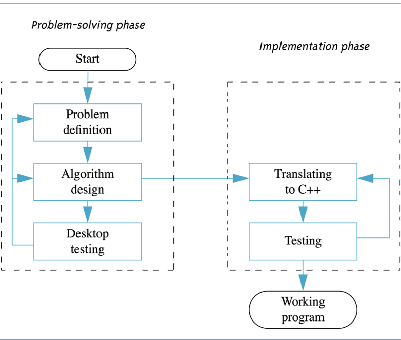

# Lab 02: Algorithms, Problem Design and Pseudocode Exercises

Welcome to CSC 211 lab 02. Yor goal for this lab will be to gain a better understanding of Pseudocode, algorithms, and how to handle programming problems. **Be sure to read and follow all instructions unless otherwise specified.** Some of the language used here has been adopted from the *OpenDSA Data Structures and Algorithms Modules Collection Chapter 8 Algorithm Analysis* text.

The table of contents for this lab is found below.

1. Introduction to Algorithms [5 minutes]
2. Problem Design Concepts [10 minutes]
3. Pseudocode Exercises [25 minutes]
4. Data Types and Arithmetic Expressions [45 minutes]
5. Compilers [15 minutes]
5. Submission [5 minutes]

Please create a **text file** named `lab-02.txt` file for your lab group to record answers to the questions in this lab.  Ensure your text file has the following format:

```text
Question 1:
-----------
<your solution here>


Question 2:
-----------
<your solution here>

...
```

# Part 1. Introduction to Algorithms  [5 minutes]

An `algorithm` is a method or a process followed to solve a problem. You might preform an algorithm every day without thinking about it. A problem can be solved by many different algorithms. A given algorithm solves only one problem.

By definition, something can only be called an algorithm if it has all of the following properties.

* **It must be correct**. In other words, it must preform a desired behavior or yield an expected result. Algorithms are intentional with a specific end-goal in mind.

* **It is composed of a series of concrete steps**. Concrete means that the action described by that step is completely understood --- and doable --- by the person or machine that must perform the algorithm. Each step must also be doable in a finite amount of time. Thus, the algorithm gives us a "recipe" for solving the problem by performing a series of steps, where each such step is within our capacity to perform. The ability to perform a step can depend on who or what is intended to execute the recipe. For example, the steps of a cookie recipe in a cookbook might be considered sufficiently concrete for instructing a human cook, but not for programming an automated cookie-making factory.

* **There can be no ambiguity as to which step will be performed next**. Often it is the next step of the algorithm description. Selection (e.g., the if statement) is normally a part of any language for describing algorithms. Selection allows a choice for which step will be performed next, but the selection process is unambiguous at the time when the choice is made.

* **It must be composed of a finite number of steps**. If the description for the algorithm were made up of an infinite number of steps, we could never hope to write it down, nor implement it as a computer program. Most languages for describing algorithms (including English and "pseudocode") provide some way to perform repeated actions, known as iteration. Examples of iteration in programming languages include the while and for loop constructs. Iteration allows for short descriptions, with the number of steps actually performed controlled by the input.

* **It must terminate**. In other words, it may not go into an infinite loop.

:white_check_mark: Question 1: Give specific examples of real-world behaviors or activities that conform to this definition of algorithms (unrelated to computer science). 

:white_check_mark: Question 2: Give specific examples of algorithms that might occur in a computer science application.


# Part 2. Problem Design Concepts [10 minutes]

Programmers commonly deal with problems, algorithms, and computer programs. These are three distinct concepts.

As your intuition would suggest, a problem is a task to be performed. It is best thought of in terms of inputs and matching outputs. A problem definition should not include any constraints on how the problem is to be solved. The solution method should be developed only after the problem is precisely defined and thoroughly understood. 


<center></center>

*from: Problem Solving with C++, 10th Edition, Walter Savitch*

As you can see, the problem solving and implementation phase are separated into different boxes. That's because these processes are somewhat independent and don't explicitly depend on each other.


# Part 3. Pseudocode Exercises [25 minutes]

`Pseudocode` is ths unspoken step in solving any programming or computer science problem. Its a way of writing something that is *almost* code, but is extremely easy for someone to read and parse in plain english. This allows for easy transfer to an actual language by the programmer in the future. Pseudocode is by no means a science, and there is no set syntax or semantics for Pseudocode, but following some basic programmatic structure while writing Pseudocode (like indentation or bracing) would not go amiss. Really good Pseudocode should be able to be read by people who have never seen a programing language before, but don't worry about achieving this level today. For this section it is **highly recommended** you make use of a whiteboard or a piece of paper to write your Pseudocode, as being able to quickly erase errors is useful.

## Part 3.1 Pseudocode Examples

Following are a few examples of different Pseudocode "styles", sourced from your lab TA's to exemplify that there is no set style as well as how to tackle writing Pseudocode for a simple problem. I will again stress **none of the following examples are meant to compile or fit the syntax of any language** they are meant to be translated from Pseudocode to whatever language you maybe writing in.

Example 01: Write Pseudocode for a function that will take a number and will print out a "countdown" to zero, with one number per line.


```
//John

Get number from user
Store it in variable named num
As long as num is not 0
    Print out the value of num
    Decrease the value of num by 1
Terminate program

```

The following example is meant to be complex, but is there to show you how Pseudocode can help you understand problems that are beyond your abilities as a programmer.

Example 02: Write psuedocode for a function that will move an enemy in a game move toward the nearest player.

```
//Christian

Retrieve the list of all players within tracking distance
Create a list of variables to represent each player's calculated distance
Loop through all players, calculating their distance from this enemy
Updating their distance variable accordingly
Move toward the closest player
Terminate program
```

## Part 3.2. Pseudocode Problems

The following are Pseudocode problems you should attempt with your groups and record your answers in your `lab-02.txt` file. All of the following problems should meet the requirements of an algorithm established in Section 1.

:white_check_mark: Question 4. Write an algorithm to print all of the even numbers from 1-100. <br/>
:white_check_mark: Question 5. Write an algorithm to print True if a given number is a prime number and false if it isn't (a prime number being a number that is only divisible by 1 and itself e.g. 47).<br />
:white_check_mark: Question 6. Write an algorithm to print the sum of all numbers up to a given number.<br />
:white_check_mark: Question 7. Write an algorithm to replace all instances of a given letter in a word with another given letter.<br />
:white_check_mark: Question 8. Write an algorithm to find the largest value in a list of numbers.<br /> 
:white_check_mark: Question 9. Write an algorithm decrease the value of every number in a series of numbers by 1.<br />


# Part 4. Data Types and Arithmetic Expressions [45 minutes]

Often times, we want to preform some type of computation on numeric data. Just like in math, we have a set of data types and operators that we can use to perform these computations with. Don't forget, a `data type` or simply type is an attribute of data which tells the compiler or interpreter how the programmer intends to use the data. Most programming languages support common data types of string, integer, double, and boolean. A data type constrains the values that an expression, such as a variable or a function, might take. This data type defines the operations that can be done on the data, the meaning of the data, and the way values of that type can be stored.

Just like in math, when we write different arithmetic expressions in c/c++, each operator has a precedence that governs when that operation takes place. You can learn more about which operators have what precedence [here](http://www.cplusplus.com/doc/tutorial/operators/).

Data types and arithmetic expressions often go hand-in-hand. Because c++ is a `statically typed language`, it is the programmers *responsibility* to declare the data type of each variable and to be mindful of the return type of an expression. For example, consider the below expression ~

```c++
#include <iostream>

int main(){

    std::cout << 7/4 << std::endl;

    return 0;
}
```

:white_check_mark: Question 10. Record what you think c++ would output for the above expression.

If you said 1, you would be correct. We know that 7 / 4 is in fact 1.75, but because the compiler sees that it's dealing with two integers, it seems natural that the output would also be an integer. In this case, the floor of 1.75 is 1. To work around this, we need to `cast` the output into the desired data type. In this example, we want a double. We can modify the expression above to be ~

```c++
#include <iostream>

int main(){

    std::cout << (double)7/4 << std::endl;

    return 0;
}
```

Now, our output will be in the correct form of 1.75. These small details can lead to very hard-to-find bugs in our program known as `semantic errors`. Unlike `syntax errors`, we have not violated the grammar of the language we are using, but the expected output is not correct because of a logical error.

**In your CS50 IDE, make several files `program1.cpp - program4.cpp`  and implement algorithms that solve the below problems.** 

### Don't forget! We typically set up an empty program like this...

```c++
#include <iostream>

int main(){

    

    return 0;
}
```


:white_check_mark: [`program1.cpp`] Implement an algorithm using c++ to apply the quadratic formula to three numbers given by the user (the quadratic formula can be seen below).<br />


<center></center>

You can assume access to `sqrt(expression)` and `pow(base, exponent)`, which can perform the square root and exponent operations, respectively. 

:white_check_mark: [`program2.cpp`] Write a program that calculates the sales tax (T) of some purchase of N dollars and returns the final cost to the buyer (N + T). You can assume that sales tax is 7.0%

:white_check_mark: [`program3.cpp`] Given some 4 digit number (4321), write a program that prints out each individual digit from right to left (1 , 2, 3, 4).

:white_check_mark: [`program4.cpp`] Write a program that asks the user for their name and greets them with their name.

:white_check_mark: [`program5.cpp`] Write a program that takes the average of three numbers that the user provides as input.

**In your lab-02 answer document:**

:white_check_mark: Question 11. Describe the different data types your group used in your program implementations for the previous questions and why you decided to use them.

# Compilers [15 minutes]

In the last few lectures, we talked about some of the different roles that compilers perform and how they help us develop code. Thanks to compilers, we don't need to focus on the syntax and convoluted control-of-flow considerations that are involved when using machine level languages. Instead, we get to focus on the semantic approaches to how a problem should be solved. 

:white_check_mark: Question 12. With your group, describe in your own words what the different roles of a compiler are.

:white_check_mark: Question 13. Name the compiler that we use in CSC 211.

Let's inspect the assembly code our compiler generates when it compiles the `program1.cpp` file that you implemented in Part 4 by running the below command.

```bash

~/ $ g++ -S programs.cpp

```

This should produce a `program1.s` file. Open that file to inspect the contents. While this is a low level language, we still need to go a few levels deeper to run these instructions on our CPUs. Lets view those instructions in their hexadecimal representation by running the below command.

```bash

~/ $ hexdump programs.s

```


For another description of what's going on here, feel free to visit this github [thread](https://superuser.com/questions/307116/how-does-a-cpu-know-what-commands-and-instructions-actually-mean).


# Part 5. Submission [5 minutes]
Each group will submit a .zip folder named `lab-02.zip` containing your `.txt` and all of your `.cpp` files in it on [Gradescope](http://gradescope.com). Instructions to download your `lab-02.txt` file can be found in the IDE introduction page that you read earlier in the lab. For your convenience, that page is relinked [here](https://cs50.readthedocs.io/ide/online/).
