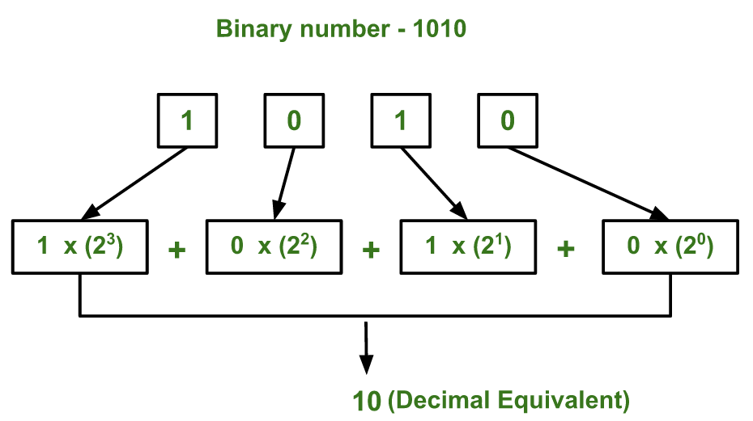
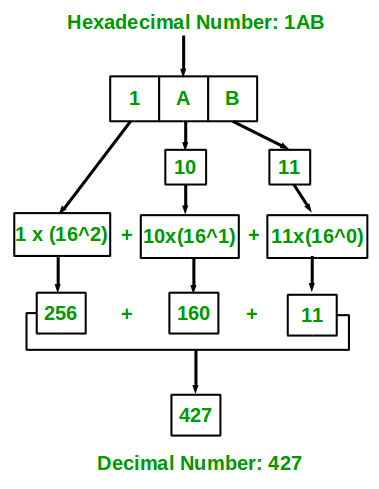

# Lab 03: Number Systems and Branching (Conditionals)

Welcome to CSC 211 Lab 03. Yor goal for this lab will be to gain a better understanding of branching, and how to handle programming problems with multiple conditionals. **Be sure to read and follow all instructions unless otherwise specified.** Some of the language used here has been adopted from the *OpenDSA Data Structures and Algorithms Modules Collection Chapter 8 Algorithm Analysis* text.

The table of contents for this lab is found below.

1. Number System Conversions[50 minutes] <br>
1.1 Examples<br>
1.2. Problem Set<br>
2. Branching (Conditionals) [50 minutes]<br>
2.1. Syntax Review<br>
2.2. Problem Set<br>
3. Submission [5 minutes]


# Part 1. Number System Conversions [50 minutes]

## Number System Conversions

How do we convert between number systems? Let's take a look at some of the different methods we can use to go from one number system to another.


#### Binary to Hexadecimal
1. Group digits into groups of 4 starting from the least significant bit. If you last grouping contains less than four characters, pad the left with zeros.
2. Read right to left, treating each group separately from the others and calculate the correct digit conversion.
- A table can help for this, as demonstrated below.

| Decimal | 0 | 1 | 2 | 3 | 4 | 5 | 6 | 7 | 8 | 9 | 10 | 11 | 12 | 13 | 14 | 15 |
| --- | --- | --- | --- | --- | --- | --- | --- | --- | --- | --- | --- | --- | --- | --- | --- | --- |
| Binary | 0000 | 0001 | 0010 | 0011 | 0100 | 0101 | 0110 | 0111 | 1000 | 1001 | 1010 | 1011 | 1100 | 1101 | 1110 | 1111 |
| Hexadecimal | 0 | 1 | 2 | 3 | 4 | 5 | 6 | 7 | 8 | 9 | A | B| C | D | E | F |

Convert 1101101 in Binary to Hexadecimal

1. Group digits into sets of 4 from the right, padding left with 0s if necessary.
- 1101101 becomes 0110 1101
2. Read right to left, treating each group separately from the others and calculate the correct digit conversion.
- 1101 becomes D
- 0110 becomes 6

6D is the Hexadecimal representation of 1101101 in Binary

#### Binary to Decimal

Take the binary number 1010. We can use the below formula to convert from the binary representation of this number to the decimal notation.

<center></center>

 > <sub><sup>Image used from https://www.geeksforgeeks.org</sup></sub>

We can convert from any number system with any base to decimal in this way. For example, instead of 2 as the base for each expression, we would use 16 if we wanted to go from hexadecimal to decimal.


### Hexadecimal Conversion

#### Hexadecimal to Binary

To go from hexadecimal to binary, we can take advantage of each hex character,  convert it into binary, and concatenate the result. 

| Hexadecimal | 0 | 1 | 2 | 3 | 4 | 5 | 6 | 7 | 8 | 9 | A | B| C | D | E | F |
| --- | --- | --- | --- | --- | --- | --- | --- | --- | --- | --- | --- | --- | --- | --- | --- | --- |
| Binary | 0000 | 0001 | 0010 | 0011 | 0100 | 0101 | 0110 | 0111 | 1000 | 1001 | 1010 | 1011 | 1100 | 1101 | 1110 | 1111 |

Example:

1. F A D A
2. 1111 1010 1101 1010

FADA Hexadecimal is 1111101011011010 Binary

> In Decimal, FADA is 64,218. Mentioning this here to showcase how a single number can take up a varying number of digits based on the number system it is being represented in.

#### Hexadecimal to Decimal

To go from Hexadecimal to decimal, we can implement the same process used to go from binary to decimal.

<center></center>

> <sub><sup>Image used from https://www.geeksforgeeks.org</sup></sub>

1. Convert the letters to their decimal counterparts.
2. From right to left, multiply each value by 16^n, where n is the position from the right starting with 0.
3. Sum the values to get the Decimal representation of the original number.

Convert 1AB to Decimal

1. Convert the letters to their decimal counterparts. 1AB becomes 1 10 11
2. From right to left, multiply each value by 16^n, where n is the distance from the right starting with 0. (1 * 16^2) (10 * 16^1) (11 * 16^0)
3. Sum the values to get the Decimal representation of the original number. 256 + 160 + 11 = 427

1AB Hexadecimal is 427 Decimal

## Number System Exercises

:white_check_mark: Question 1. For each of the number systems discussed, how many unique values can be represented by 4 digits from that system?
1. Binary
2. Decimal
3. Hexadecimal

:white_check_mark: Question 2. Convert 74F8E9DA Hexadecimal to Decimal.

:white_check_mark: Question 3. Convert 11011010101 Binary to Hexadecimal.

:white_check_mark: Question 4. Convert 628 Decimal to Binary.

:white_check_mark: Question 5. Convert 128472481 Decimal to Hexadecimal.

:white_check_mark: Question 6. Convert 74F8E9DA Hexadecimal to Binary.

:white_check_mark: Question 7. Convert 11011110101 Binary to Decimal.

# Part 2. Conditionals [50 minutes]
Branching statements are among some of the core concepts available in almost every modern programming language. They come in varying forms depending on the language you work with. To focus on C++ syntax specifically, there are four main types of branching statements availble in C++, the `if` statement, the `if/else if/else` statement, the `in-line if`, and the `switch` statement. The following are examples of syntax for each of the above.

```c++
/** The if statement
 * The if statement is the simplest of branching options. It allows for the testing of 
 * a conditional within parentheses and executing a set of statements if the condtional
 * evaluates to true. It should also be noted that the curly braces are optional, 
 * though if omitted the if statement will execute the next line after it if the 
 * conditional was true.
 */
if(<condition>) {
    // statements to execute if condition is true
}
``` 

```c++
/** The if/else if/else statement
 * The if/else if/else statement is the logical next step in complexity. It allows for 
 * testing a series of conditionals and executing a set of statements based on which
 * conditional was true. Any number of else if blocks can follow the if, and any 
 * combination of the (if, else if, and else) are valid in C++.
 * The first conditional to evaluate as true is the only one 
 * that will execute, and if none of the ifs or else ifs are true, then the statements 
 * in the else section will execute. 
 */
if(<condition>) {
    // statements to execute if condition is true
}
else if(<condition2>) {
    // statements to execute if condition2 is true
}
else {
    // statements to execute if neither condition nor condition2 is true
}
``` 

```c++
/** The switch statement 
* The switch statement is particularly useful when you have a large amount of possible 
* values to test, and executing statements based on which was true. Switches are unique
* as as soon as a case evaluates to true all cases that follow it will also execute  
* their statements unless a break is included.
*/
switch(<value>) {
    case <desired value>: 
        // statements to be executed if value == desired value
        break;
    case <desired value2>: 
        // statements to be executed if value == desired value2
        break;
    case <desired value3>: 
        // statements to be executed if value == desired value3
        break;
    default: 
        // statements to execute if none of the above cases were true
}
```

```c++
/** The in-line if
 * The in-line if is a statement that allows the functionality of an if statement
 * to be written on a single line.
 */
(<condition>) ? <statement if condition is true> : <statement if condition is false>;
```

## 2.1. Debugging
With the introduction of branching we are also introducing your first opportunity to make semantic errors in your code, that is to say bugs. Debugging is a vital step of programming and being able to identify errors as you make them can help to prevent hours of searching later. The following examples of code will all contain errors in some capacity, do your best to determine what that error is, what it will cause the code to do, and how to fix it.

:white_check_mark: Question 8.
```c++
#include <iostream>
int main() {
    int test = 0;

    if(test = 10) {
        std::cout << "Hello World" << std::endl;
    }
    else {
        std::cout << "foo bar" << std::endl;
    }
    return 0;
}
```

:white_check_mark: Question 9.
```c++
#include <iostream>
int main() {
    int test = 0;

    if test == 10 {
        std::cout << "Hello World" << std::endl;
    }
    else {
        std::cout << "foo bar" << std::endl;
    }
    return 0;
}
```

:white_check_mark: Question 10.
```c++
#include <iostream>
int main() {
    int test = 0;

    if (test == 0) 
        std::cout << "Hello World" << std::endl;
        std::cout << "Hello World2" << std::endl;
    else {
        std::cout << "foo bar" << std::endl;
    }
    return 0;
}
```

## 2.2. Programming Portion
<!--- simple branching / switch problem --->
:white_check_mark: program1.cpp. Implement an algorithm using C++ that outputs the letter grade from a number grade. You can use a typical grade scheme found [here](https://pages.collegeboard.org/how-to-convert-gpa-4.0-scale).

<!--- forced if/elif/else --->
:white_check_mark: program2.cpp. Implement an algorithm using C++ to detect a speeding car, given that the speed limit is 50 mph. This algorithm should have three possible outputs, "Safe" for any speed below the limit, "Pushing your luck" for any speed in the range [50-55]mph, and "Speeding" for any speed greater than 55. 

<!--- simple branching --->
:white_check_mark: program3.cpp. Implement an algorithm using C++ to determine if a number is prime. This algorithm should have two possible outputs, Prime" if a number is prime, "Not Prime" otherwise.

<!--- branching with chars --->
:white_check_mark: program4.cpp. Implement an algorithm using C++ to determine if a given letter is capitalized or not. This algorithm should have two possible outputs, "Upper Case" if a letter is capital, "Lower Case" otherwise.

<!--- when to not use if/elif/else --->
:white_check_mark: program5.cpp. Implement an algorithm using C++ to implement the following rules. Note that a single entry can trigger multiple rules.
* Output 1 if the number is even.
* Output 2 if the number is odd.
* Output 3 if the number is evenly divisible by 2.
* Output 4 if the number is evenly divisible by 3.

Examples: 
* If 6 is entered, the program would output "134"
* If 9 is entered, the program would output "24"

<!--- Different conditional tests (!=, && ||) --->
:white_check_mark: program6.cpp. Implement an algorithm in C++ to test if a number is within a range given by the user, using a single if statement. This should take three values from the user those being (in order) the lower bound on the range, the upper bound on the range, and then the number to be tested.
```c++
std::cin >> low >> high >> test;
// implement a test for [low <= test <= high]
```

:white_check_mark: program7.cpp. Implement an algorithm in C++ to print the maximum of three given numbers. This should take three values from the user (in any order) and print out the largest of the three.

# Part 3. Submission [5 minutes]

Each group will submit a single **.zip file** named `lab-03.zip` containing all your answers to the lab questions in your `lab-3.txt` and all of your `.cpp` source code files on Gradescope before the end of your lab section. All submissions should be made by a **group/team**. *Individual submissions will not be accepted*. Instructions to download your lab-03.txt file can be found in the IDE introduction page that you read earlier in the lab. For your convenience, that page is relinked here.
