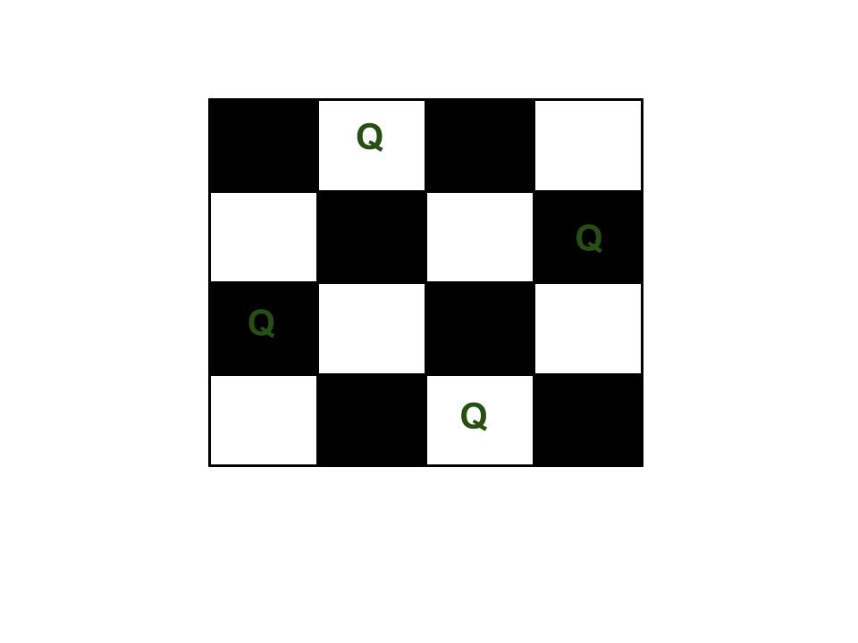

# Lab 10: Advanced Recursion

Welcome to CSC 211 Lab 10. Your goal for this lab will be to gain a better understanding of advanced recursion methods and its uses. **Be sure to read and follow all instructions unless otherwise specified.**  Create a `lab-10.txt` document to record all of your lab answers in and implement all of your `.cpp` programs in your IDE.

1. Recursive Stack Behavior<br>
2. Recursion Trees<br>
3. Practice Stack and Tree Problems<br>
4. Advanced Recursion<br>

# 1. Recursive Stack Behavior

It is important to truly understand the power of recursion we understand how these functions behave on the stack. In general, recursive functions build out long snaking stack frames that require a subsequent function call to complete. What this allows us to do is have partially completed calls to functions that resolve after a simpler version has resolved. For example copy and paste the following code into python tutor:

```c++
#include <iostream>
int fib(int n) {
  if(n < 2) {
    return n;
  }
  return fib(n-1) + fib(n-2);
}

int main() {
  std::cout << fib(6) << std::endl;
  return 0;
}
```

Notice how the stack frame continually grows and shrinks as recursive calls are made. You may remember the recursion tree for this function from last weeks lab, remembering its form may help you to answer the following questions:

:white_check_mark: Question 1: What is happening when the stack grows?

:white_check_mark: Question 2: What is happening when the stack shrinks?

# 2. Recursion Trees 

Recursion trees are very useful visualizatons of what a recursive function actually looks like. They are especially useful when trying to understand exactly what it is a recursive function is doing. For example:

:white_check_mark: Question 3: Determine what the following function does and draw a recursion tree for it when n = 6:

```c++
int foo(int a) {
    if(a < 3) {
        return a;
    }

    return foo(a-3) + foo(a-2) + foo(a-1);
}
```

# 3. Practice Stack and Tree Exercises

The following problems are example solutions to some last weeks labs problems, we strongly encourage you to try and draw recursion trees and stack frames for some of the following.

:white_check_mark: Question 3: Given the following function, draw a recursion tree for n = 5, and indicate the status of the stack after 3 recursive calls(i.e. NOT including the call that would have been made in main):

```c++
unsigned int fact(int n) {
    if(n < 2) {
        return 1;
    }

    return n * fact(n - 1);
}
```

:white_check_mark: Question 4: Given the following function, draw a recursion tree for n = 12345, and indicate the status of the stack after 4 recursive calls(i.e. NOT including the call that would have been made in main):

```c++
int sum_digits(unsigned int n) {
    if(n == 0) {
        return n;
    }

    return n % 10 + sum_digits(n / 10);
}
```

:white_check_mark: Question 5: Given the following function, draw a recursion tree for str = "tacocat", and indicate the status of the stack after 2 recursive calls(i.e. NOT including the call that would have been made in main):

```c++
bool palindrome(std::string str) {
    if(str.length() < 2) {
        return true;
    }
    
    int length = str.length();
    
    // characters don't match
    if(str[0] != str[length-1]) {
        return false;
    }
    
    return palindrome(str.substr(1, length-2));
}
```

:white_check_mark: Question 6: Given the following function, draw a recursion tree for arr = [1, 2, 3, 4, 5, 6, 2] and n = 7, and indicate the status of the stack after 3 recursive calls(i.e. NOT including the call that would have been made in main):

```c++
#include <iostream>
bool is_sorted(int* arr, int n) {
    if(n < 2) {
        return true;
    }
  
    if(arr[0] < arr[1]) {
        return is_sorted(arr + 1, n-1);
    }
    else {
        return false;
    }
}
```

# 4. Advanced Recursion

## Advanced Recursive Thinking

We can use some recursive thinking to recursively build permutations of a string. For example if we use the string 'Cat' as an example, this string has 6 permutations:

```
Cat
Cta
aCt
atC
tCa
taC
```

We can use some recursive processes to represent this problem and build our strings.

:white_check_mark: Program 1: Write a recursive function with the header `void permute_str(std::string current, std::string choices);` that will recursively build all permutations of a string it receives in main as its `choices` argument.

## Recursive Backtracking

We can use a recursive function to build a solution incrementally. This is known as Backtracking, and is a common way to utilize recursion. The idea is to attempt a large number of solutions, and throw out those that don't yield a correct solution. 

A simple program we'll illustrate and you can attempt is the Coin Change problem. The function will accept an amount of change, and an array of allowed coin values, and yield the # of ways there are to make the correct change.

Since we stated we attempt solutions and throw those that don't satisfy the problem constraints, we can phrase the question as "What combination of coins evenly combine to make our total?" But since we are incrementally building the solution, we can rephrase this to "Given I still have *n* change to calculate, what combination of coins sum to make *n*?"

E.g. f(10, [25, 10, 5, 1]) would yield 4.

For 10 cents and the coin values of 25, 10, 5, and 1, we could logically compute the following:

```
10
    10 - 25 = -15. This is an invalid solution, throw it out.
    10 - 10 = 0. This is a valid solution, +1! (Solution 1: 1 dime)
    10 - 5 = 5. We haven't finished yet. What are the possible combinations to make 5?
    5
        5 - 25 = -20. Invalid.
        5 - 10 = -5. Invalid.
        5 - 5 = 0. This is a valid solution, +1! (Solution 2: 2 nickels)
        5 - 1 = 4.
        4
            ...
            3
                ...
                2
                    ...
                    1
                        ...
                        1 - 1 = 0. This is a valid solution, +1! (Solution 3: 1 nickel 5 pennies)
    10 - 1 = 9  
    9
        ...
        8
            ...
    //Note: If we keep subtracting 1, we'll eventually get to a point where we re-calculate for 5! This would double-count 2 nickels and give us an incorrect answer. Come up with a solution to this snag. This section should yield (Solution 4: 10 pennies).
```

The 4 solutions pointed out above are shown expanded here.
```
10                                      //1 dime
5 + 5                                   //2 nickels
5 + 1 + 1 + 1 + 1 + 1                   //1 nickel + 5 pennies
1 + 1 + 1 + 1 + 1 + 1 + 1 + 1 + 1 + 1   //10 pennies
```

:white_check_mark: Program 2: Implement the described function using the following hints:
- Remember to start with your base cases.
- The example above gives a hint on the order to check the values in.
- Get a working solution that overcounts, then trim it down so it accurately counts.
- Draw this out! This will be infinitely easier if you draw the trace of what you expect to be happening, and compare it to a drawing of the trace that is actually happening.
- Notice that the calculation for the # of ways to make 5 cents will yield 2, so you cannot return immediately from your conditionals. Have 1 return statement at the end of the function to cover all of the conditionals other than the base cases.

:white_check_mark: Program 3: Implement N-Queens

The N Queen is the problem of placing N chess queens on an N×N chessboard so that no two queens attack each other. For example, following is a solution for 4 Queen problem.



:white_check_mark: Program 4: Implement all possible N length binary strings.

:white_check_mark: Program 5: Find Greatest Common Divisor (GCD) of 2 numbers using recursion.

