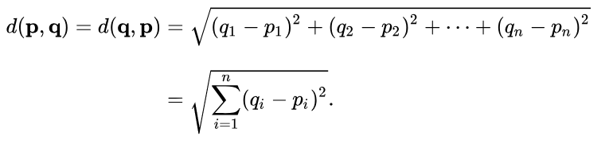

# Lab 10: Classes

Welcome to CSC 211 Lab 11. Your goal for this lab will be to gain a better understanding of classes. **Be sure to read and follow all instructions unless otherwise specified.**  Create a `lab-11.txt` document to record all of your lab answers in and implement all of your `.cpp` programs in your IDE.

1. Class Overview & Lecture [30 mins]<br>
2. Exercises [75 mins]<br>

# 1. Class Overview [30 mins]

Up until now we have been solving problems from a data-focused perspective. That is, we model a problem in terms of the raw data presented and manipulate that data directly to solve the problem at hand. 

Object-Oriented Programming is all about solving a problem by creating accurate abstract representations of real-world phenomena, and having those abstractions interact with each other to produce a solution. Classes are the primary tool that allows us to model these abstractions. Anything that you can interact with in the real world can be abstracted and modeled as a class. Once done, the Object-Oriented Programming language we are in will allow us to instantiate (create an instance of) this modeled abstraction as an object via its **constructor** for use in interacting with other objects.

C++ splits the declaration of a Class into two files: the header file (.h, for declarations) and the source file (.cpp, for definitions.) In the following example, we **declare** a "Point" Class, and the Constructor used to create an object from this Class.

Bike class ~ Lecture


# 2. Exercises [ 75 mins]

:white_check_mark: Question 1: Write a class that creates Cartesian coordinates in a 3D space (x, y, z). Below are the class member variables and methods you need to implement.
```c++
int x;
int y;
int z;

//Constructs a point object with X, Y, Z properties
Point(int someX, int someY, int someZ);

//Sets the X, Y, and Z properties of a point Object
void setX(int someX);
void setY(int someY);
void setZ(int someZ);

//Gets the X, Y, and Z properties from a point Object
int getX();
int getY();
int getZ();

//Returns a cartesian coordinate representation of a point Object
// aka = (x,y,z)
std::string toCord();

//Calculates the Euclidean Distance of two points
double euDistance (Point p2);

```
Your point class should work with the main function below.

```c++
#include <iostream>
#include "Point.h"

//No need to touch the main.cpp file. However - if might be helpfull
//to look at how I'm using your soon-to-be defined Point.cpp class

int main(){

    Point myPt(10, 5, 8);
    Point myPt2(3, 10, 15);

    int myX = myPt.getX();

    std::cout << myX << std::endl;

    std::cout << myPt.toCord() << std::endl;

    myPt.setX(3);

    std::cout << myPt.toCord() << std::endl;

    std::cout << myPt.euDistance(myPt2) << std::endl;

return 0;
}

```

A formal definition for Euclidean distance can be found below:

The Euclidean distance between points p and q is the length of the <a src="https://en.wikipedia.org/wiki/Line_segment"> line segment </a> connecting them (qp).

In Cartesian coordinates, if p = (p1, p2,..., pn) and q = (p1, q2,..., qn) are two points in Euclidean n-space, then the distance (d) from p to q, or from q to p is given by the Pythagorean formula:



:white_check_mark: Question 2: Write a 'car' class that creates car objects with the below properties and make 3 different car objects initialized with different properties.

```c++
std::string make;
std::string model;
std::string color;
int year;
double mileage;


//Constructs a car object
Car(std::string make, std::string model, std::string color, int year);

//Setters for objects of type car
void setMake(std::string someMake);
void setModel(std::string someModel);
void setColor(std::string someColor);
void setYear(int someYear);
void setMileage(double someMileage);

//Getters for objects of type car
std::string getMake();
std::string getModel();
std::string getColor();
int getYear();
double getMileage();

//Prints all member variables to console
void printDetails();
```

:white_check_mark: Question 3: Visit this [class definition](https://www.partow.net/programming/bitmap/index.html) and use it to create different bitmap objects.
