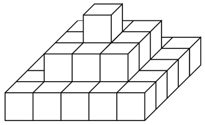

# Building Pyramids

Figure 1: An example pyramid of height 3 with 35 blocks.
When initiating a larger project, like building a pyramid, it’s best to think twice. Your task today is to write a program that computes how high a pyramid can be built given a certain number of blocks of stone.

We assume that the pyramid to be built is compact, i.e. there are no cavities inside. Furthermore, we assume it is built according to the principle in Figure 1. Each layer is square, with a side length that is two less than the one below it. The top layer always consist of a single block.

It is fine if you have leftover blocks, as long as you build a complete pyramid.

## Input

The first and only line of input contains an integer N (1 <= N <= 100000000), the number of blocks you have available.

## Output

Output a single integer – the maximum height of a pyramid that can be built with at least N blocks.
