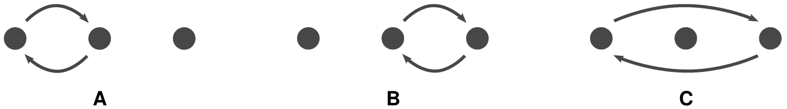

## Mini Programming Challenge #07

Jealous of Mirko’s position as head of the village, Borko stormed into his tent and tried to demonstrate Mirko’s incompetence for leadership with a trick.

Borko puts three opaque cups onto the table next to each other (opening facing down) and a small ball under the leftmost cup. He then swaps two cups in one of three possible ways a number of times. Mirko has to tell which cup the ball ends up under.



Wise Mirko grins with his arms crossed while Borko struggles to move the cups faster and faster. What Borko does not know is that programmers in the back are recording all his moves and will use a simple program to determine where the ball is. Write that program.

## Input

The first and only line contains a non-empty string of at most 50 characters, Borko’s moves. Each of the characters is ‘A’, ‘B’ or ‘C’ (without quote marks).


## Output

Output the index of the cup under which the ball is: 1 if it is under the left cup, 2 if it is under the middle cup or 3 if it is under the right cup.


#### Input Example

```
CCBBCCBAABCCAAABABBAABBCBBABAA
```

#### Output Example

```
3
```
